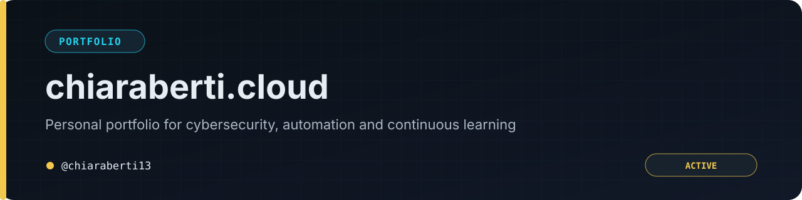

<p align="center"></p>

<p align="center"><a href="README.md">🇬🇧 English</a> · <a href="README.it.md">🇮🇹 Italiano</a></p>

<p align="center">
  
  
  
  
</p>

> A bilingual personal portfolio focused on cybersecurity, automation, Linux and continuous learning.

<p align="center"><a href="https://chiaraberti.cloud"><strong>Live website</strong></a> · <a href="SECURITY.md">Security</a></p>

---

## Commands

```bash
npm install
npm run dev
npm run build
npm run preview
npm run check
```

Requires Node.js 20 or newer.

## Content and configuration

Identity, social links and enabled sections are configured in `src/config/site.ts`. Bilingual content and project entries live in the project content files, keeping personal information separate from presentation components.

## Languages

The website supports Italian and English. Navigation, metadata and project content should be updated in both languages in the same change.

## Security and privacy

The site is statically generated. Do not commit private contact data, credentials or environment files. Review dependency reports in context and follow [SECURITY.md](SECURITY.md) for private vulnerability reporting.

## Deployment

The production build is deployed on Vercel. Changes should pass the local type/content checks and production build before deployment.

## Project structure

- `src/config/`: profile and site configuration;
- `src/content/`: bilingual content;
- `src/components/`: reusable interface components;
- `public/`: static assets;
- `dist/`: generated build output.
